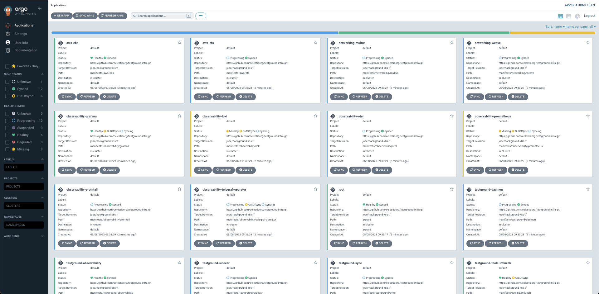

# Description

This page provides a detailed overview of TestGround, its services, infrastructure, architecture, and more. TestGround is an open-source testing framework that helps blockchain developers test their systems at scale. It offers a range of features and tools to facilitate the testing process, including network emulation, performance monitoring, and automated testing.

---

# Why TestGround?

TestGround was created to solve the challenges associated with testing blockchain systems at scale. The main goal of the framework is to provide developers with a tool that can generate realistic feedback on blockchain performance. TestGround accomplishes this by creating an environment that simulates real-world conditions, allowing developers to test their systems under different scenarios and loads.

TestGround leverages Kubernetes as the underlying platform for testing. Kubernetes is an open-source container orchestration system that automates the deployment, scaling, and management of containerized applications. By using Kubernetes, TestGround can take advantage of its robust features, including high availability, scalability, and fault tolerance. Additionally, Kubernetes makes it easy to manage TestGround clusters and provides a flexible and efficient way to run tests in parallel (soon).

---

# Kubernetes Cluster

## Cluster Creation

Creating a new Kubernetes cluster with TestGround is a straightforward process. To get started, you'll need to import the desired variables, such as the number of nodes, the type of node, and the network configuration. Once you have your variables in place, you can execute the create-cluster script. The create-cluster script is a shell script that automates the process of creating a new Kubernetes cluster. It performs all the necessary steps, including setting up the cluster infrastructure, configuring the network, and deploying the necessary components.

In addition to the create-cluster script, TestGround provides other scripts to manage your cluster, such as scale-up and scale-down scripts to increase or decrease the number of nodes in the cluster. TestGround also includes a teardown script to remove the cluster when you're done testing.

The variables are:

```bash
#!/bin/bash
export CLUSTER_NAME=
export DEPLOYMENT_NAME=
export WORKER_NODE_TYPE=
export MASTER_NODE_TYPE=
export MAX_WORKER_NODES=
export MIN_WORKER_NODES=
export TEAM=
export PROJECT=
export AWS_REGION=
export KOPS_STATE_STORE=
export ZONE_A=
export ZONE_B=
export PUBKEY=
export AWS_ACCESS_KEY_ID=$(aws configure get aws_access_key_id)
export AWS_SECRET_ACCESS_KEY=$(aws configure get aws_secret_access_key)
```

```bash
./install_k8s.sh cluster.yaml
```

Wait some minutes until you will see that the script has finished and the cluster is up & running.

---

## Cluster Provisioning

After executing the **install_k8s.sh** script, you'll notice that some pods are being created automatically. This is because TestGround is provisioning the cluster with all the required tools to run tests at scale. TestGround uses ArgoCD, an open-source continuous delivery tool, to manage the deployment and configuration of the required components.

ArgoCD provides a declarative way to manage applications and infrastructure as code. It helps to automate the process of deploying and managing the necessary components in the cluster, ensuring that the TestGround environment is up and running quickly and efficiently. By using ArgoCD, TestGround can manage the deployment and configuration of the required components automatically, ensuring that developers can focus on testing their blockchain systems rather than managing infrastructure.

If you're interested, you can access the ArgoCD dashboard to monitor what's happening in the background. The dashboard provides a comprehensive view of the state of the TestGround environment, including the deployment status of the required components and any errors or issues that may arise. Additionally, the dashboard provides access to various configuration settings, enabling developers to fine-tune the TestGround environment to meet their specific needs.

In summary, TestGround uses ArgoCD to automate the process of deploying and managing the required components in the cluster. The ArgoCD dashboard provides a comprehensive view of the state of the TestGround environment, enabling developers to monitor the deployment status of the required components and fine-tune the environment to meet their specific needs.

```bash
kubectl -n argocd port-forward svc/argocd-server 8080:443
```

The default user is `admin` and you can find the ArgoCD password using the command:

```bash
kubectl -n argocd get secret argocd-initial-admin-secret -o jsonpath="{.data.password}" | base64 -d
```

In the dashboard, you will find something like:



All these boxes are the ArgoCD apps, meaning that we are provisioning the cluster using these apps and the ArgoCD’s purpose is to manage them and be sure that all of them are working fine and synced.

*The whole process takes around 12-15’, so please, be patient.*

---

**note**:

If *you access the ArgoCD dashboard, and you find the root application in Unknown status, please wait, this s because the services are being created in the background, they will be ready in the next 5-6’.*


---

# Kubeconfig


Once you have created the cluster, you might need to export the [kubeconfig](https://kubernetes.io/docs/concepts/configuration/organize-cluster-access-kubeconfig/).

You can do it by executing the following command:

```bash
# First of all, you will need to source the variables in order to use them later here.
kops export kubecfg --admin --kubeconfig ~/.kube/cluster_kubeconfig --state=$KOPS_STATE_STORE --name=$CLUSTER_NAME
```

---

# Scripts

List of the scripts and their purpose:

- **install_k8s.sh:**

    ## Description

    This is a Bash script that is used to spin up a new Kubernetes cluster using Kops. Also, the tool creates an ArgoCD app to provision the cluster. The script requires the following variables to work:

    - **`CLUSTER_NAME`**: the name of the cluster.
    - **`DEPLOYMENT_NAME`**: the name of the deployment.
    - **`WORKER_NODE_TYPE`**: the type of worker node.
    - **`MASTER_NODE_TYPE`**: the type of the master node.
    - **`MAX_WORKER_NODES`**: max number of worker nodes.
    - **`MIN_WORKER_NODES`**: min number of worker nodes.
    - **`TEAM`**: the name of the team responsible for the deployment.
    - **`PROJECT`**: the name of the project.
    - **`AWS_REGION`**: the region where the cluster is to be created.
    - **`KOPS_STATE_STORE`**: the name of the S3 bucket where the Kops state store is located.
    - **`ZONE_A`**: the availability zone A for the cluster.
    - **`ZONE_B`**: the availability zone B for the cluster.
    - **`PUBKEY`**: the path to the public key that will be used to access the cluster.
    - **`AWS_ACCESS_KEY_ID`**: the AWS access key ID to access the AWS account where the cluster will be created. This variable is set using the **`aws configure get aws_access_key_id`** command.
    - **`AWS_SECRET_ACCESS_KEY`**: the AWS secret access key to access the AWS account where the cluster will be created. This variable is set using the **`aws configure get aws_secret_access_key`** command.

    The script creates an ArgoCD app, installs Weave, CNI-Genie, and Sidecar Daemonset, and creates EFS resources & storage classes. The script also installs a default container limit and sets up an ArgoCD root app.

    ### **Usage**

    To use this script, you need to set the required variables in the script and execute it using the command**`./01_install_k8s cluster.yaml`**.

    ### **Dependencies**

    This script has the following dependencies:

    - **`awscli`**
    - **`envsubst`**
    - **`kubectl`**
    - **`kops`**
    - **`terraform`**
    - **`helm`**
- **delete_kops.sh**: delete all the resources, Terraform, and the Kubernetes cluster.

---

# Conclusion

Overall, TestGround is a powerful testing framework that offers a range of features and tools to facilitate blockchain testing. By using Kubernetes as the underlying platform, TestGround can take advantage of its robust features, making it easy to manage clusters and run tests in parallel (soon). If you're a blockchain developer looking to test your system at scale, TestGround is definitely worth checking out.

---
